# Assignment 01 - Spam Detector
CSCI 2020U: Software Systems Development and Integration

## Project Information

This program determines the probability of an email being spam. It filters based on repeated keywords from a set of existing emails.

Authors: Charis Chan, Beatriz Provido, Gordon Law, Jerico Robles

### SpamDetectorServer - Endpoints

- `http://localhost:8080/spamDetector-1.0/api/spam` content type: Listing all the test files.

- `http://localhost:8080/spamDetector-1.0/api/spam/accuracy` content type: Calculates and gets the accuracy.

-  `http://localhost:8080/spamDetector-1.0/api/spam/precision` content type: Calculates and gets the precision.

### Improvements made

The first change done to the interface and model is to first filter each word by removing all the non-letter characters except " ' ", and replacing them with spaces instead. The second alteration is to remove all words containing a space as only the words that have a space are words that would not pass the first filter. The next change applied is that if there is a case where there are " ' " at the front or the back of a character, " ' " would then be taken out. Afterwards, the next modification is to get rid of all the words that have three consecutive characters that are the same. Then, as the program goes through the list of words, the next modificatio is to remove any words that have over 20 characters. The final change is to eliminate any words with a specific sequence of two characters (e.g. words containing "jj" would not be permitted).\
\
Changes made to the UI consist of the following:
- Changed font to ROBOTO
- Created sidebar
- Put table of contents in sidebar 
- Included results, information about the filtering system, an About Us, references, and top of page 
- Created a table that is easy to read the results 
- Created a footer where the references are in

### How to run

`Go to Github website page and click on the code dropdown to obtain and copy the https:// link to access the repository.`
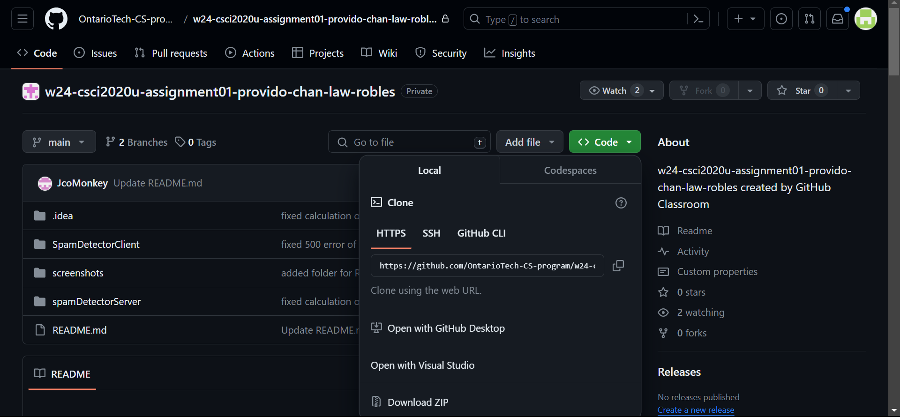
`Next, open IntelliJ and click on "Get from VCS".`
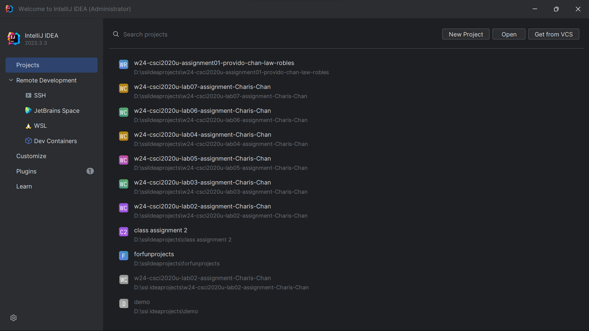
`Then, paste the URL into the URL input box and choose the desired directory to clone your repository into.`
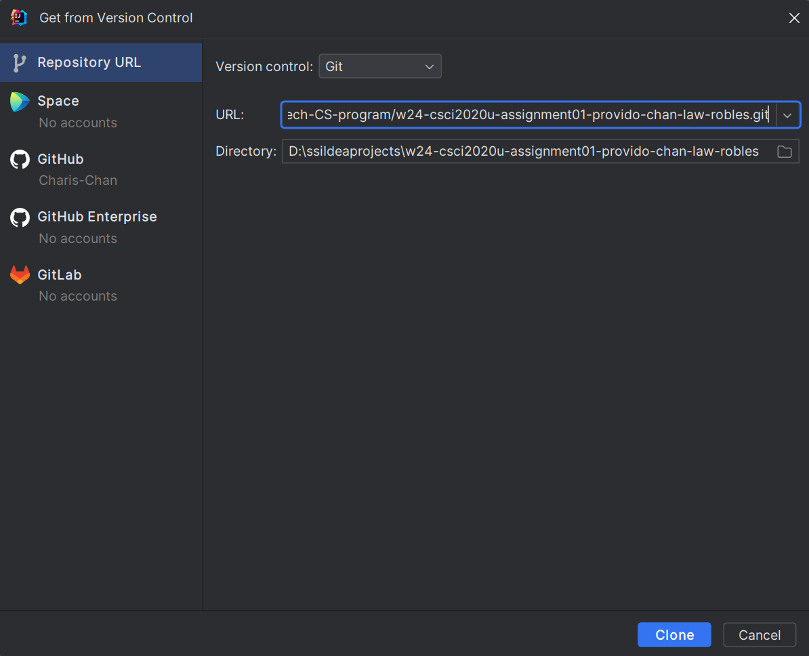
`If you'd rather get the repository from the command line, use: $ git clone {url} after navigating to the desired directory`
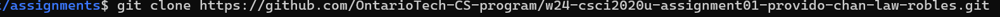
`After successfully cloning and opening the project, make sure to load maven properly.`
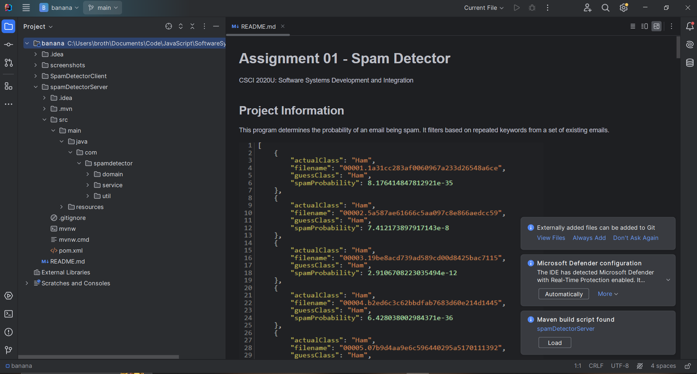
`Next, go to Run menu and click on "Edit Configurations".`
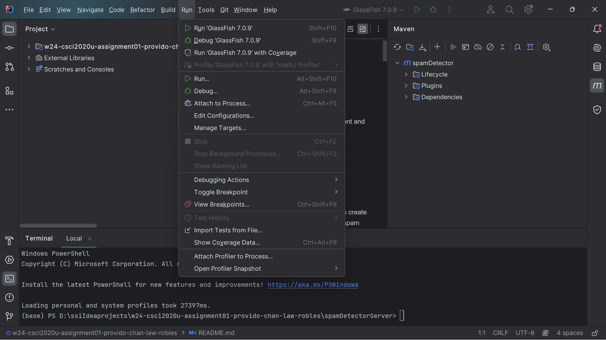
`Click on "Add New Configuration" located inside the configuration menu, and select "Glassfish Server => Local".`\
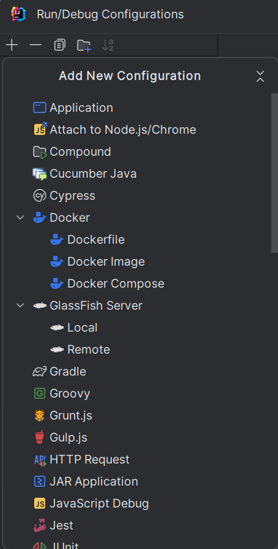\
`Fill in the URL, JRE, and Server Domain as seen in the screenshot below:`
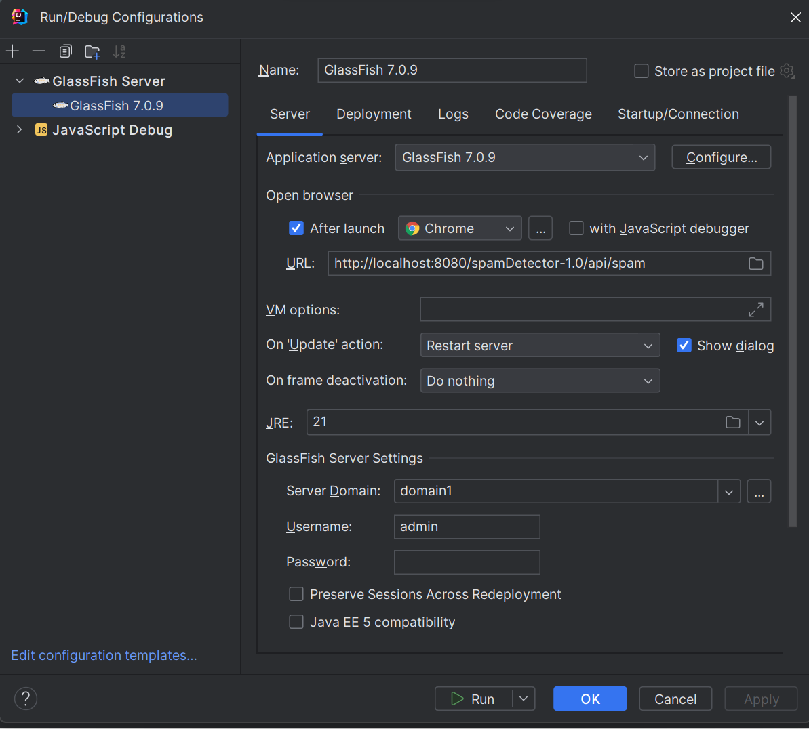
`Then, go to Deployment tab and select Artifact followed by spamDetector:war exploded, click Apply => OK.`
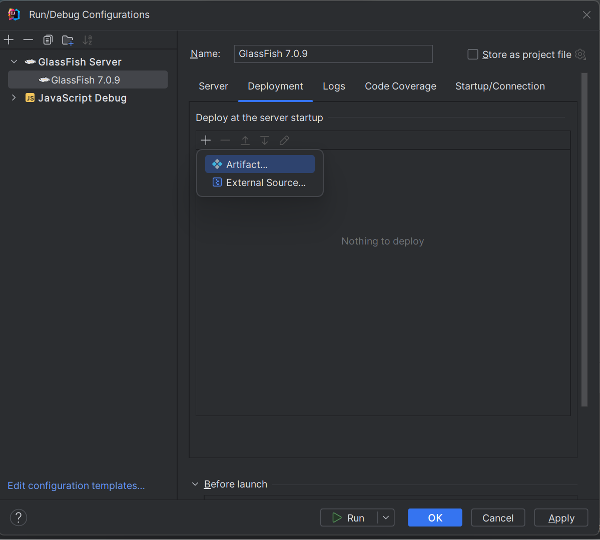
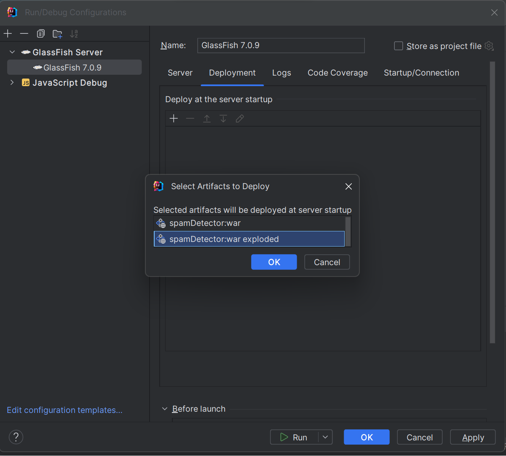
`Afterwards, click on the green arrow beside the GlassFish version and wait for the server webpage to open.`
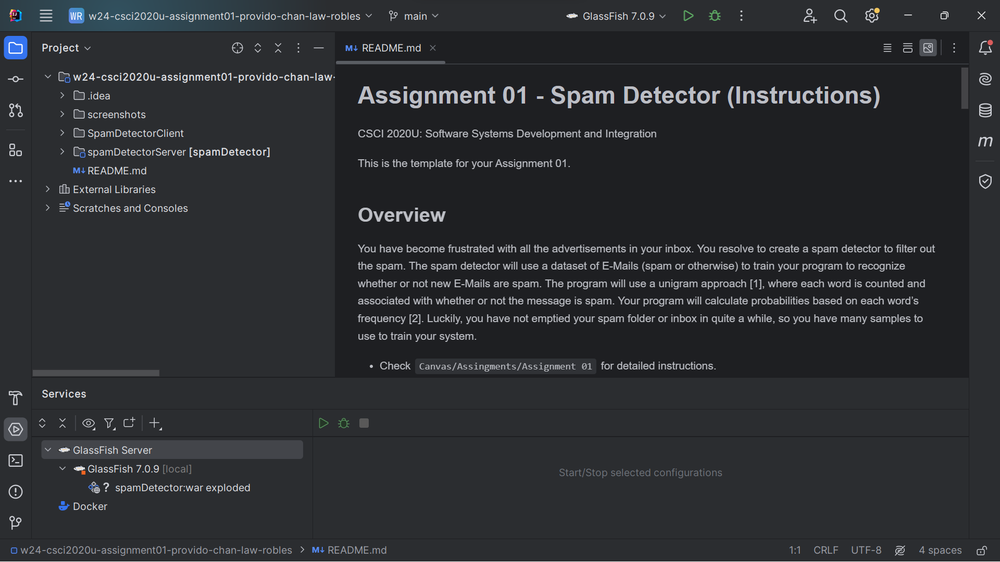
`Finally, in the SpamDetectorClient folder, right click on the file index.html and click Run 'index.html'.`
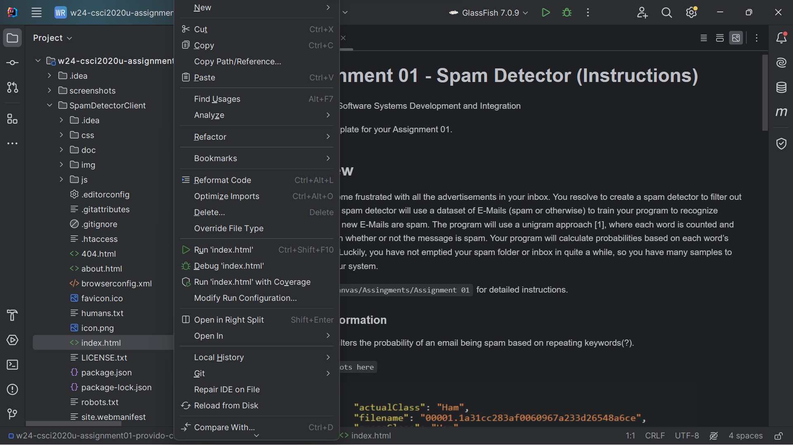

### References and Other Resources
[1] https://en.wikipedia.org/wiki/Bag-of-words_model 

[2] https://en.wikipedia.org/wiki/Naive_Bayes_spam_filtering 

[3] https://chem.libretexts.org/Courses/Ontario_Tech_University/OTU-_Chemistry_1010/01%3A_Chemical_Tools-_Experimentation_and_Measurement/1.09%3A_Accuracy_Precision_and_Significant_Figures

[4] https://www.omnicalculator.com/statistics/accuracy

[5] from emailparser  https://www.jojhelfer.com/lettercombos

[6] from emailparser https://stackoverflow.com/questions/37089227/how-to-remove-3-or-more-consecutive-letters-in-java-into-2-consecutive-letters
